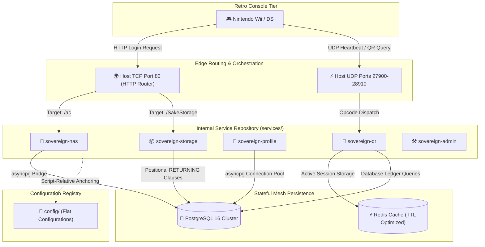

# 🏗️ Project Sovereign Cluster Architecture

This document visualizes and defines the high-availability, containerized microservice ecosystem deployed in Project Sovereign.

---

## 🗺️ Unified Component Map

Below is the structured interaction path from a retro console client, traversing through edge gateways and into the internal microservices mesh backed by high-speed state caching and persistence pools.



---

## 🧬 Core Architectural Foundations

### 1. Script-Anchored Layout Independence
Every component within `services/` relies on absolute layout anchoring (`__file__`). 
- When [dwc_config.py](file:///Users/kalaimaranbalasothy/GitHub%20Projects/Project%20Sovereign/dwc_config.py) resolves flat `.cfg` assets, it calculates paths relative to its script home, rather than relying on the active working directory.
- This decoupling guarantees that services operate perfectly when invoked via Python direct scripts (`python services/nas_server.py`), Docker composition files, or automated test fixtures (`pytest`).

### 2. The Self-Healing Microservices Paradigm
Project Sovereign translates the legacy monolithic emulator into completely autonomous containerized threads:
- **Fault Isolation:** A fatal parsing exception within the HTTP `storage_server` will only trigger an isolated container restart for that specific Pod. Active multiplayer UDP lobbies hosted in the `sovereign-qr` container survive without disruption.
- **Autonomous Lifetime:** Orchestrators (Docker Compose or Kubernetes) automatically monitor health endpoints and perform sub-second container resurrection if any service daemon exits with error status.

### 3. Zero-Touch Discovery Mesh
Services utilize standard environmental discovery injectors (`os.environ.get`) to dynamically construct internal database configurations:
- **Environment Context:**
  - **Docker Compose:** Resolves internal bridge network hostnames (e.g., `sovereign_db`).
  - **Kubernetes (K3s):** Binds to cluster-wide service endpoints (e.g., `postgres.default.svc.cluster.local`).
  - **Standalone Local Developer:** Gracefully defaults to `localhost:5432` for easy testing without networking overhead.

---

## 🚦 Execution Layout Configurations

### Option A: Local Development Shell
Utilizes standard direct python scripts for local tinkering and testing:
```bash
source venv/bin/activate
python services/nas_server.py
```

### Option B: Multi-Container Orchestration (Docker Compose)
Leverages the root [docker-compose.yml](file:///Users/kalaimaranbalasothy/GitHub%20Projects/Project%20Sovereign/docker-compose.yml) to spin up PostgreSQL, Redis, and 12 custom Python server containers simultaneously:
```bash
docker compose up -d
```
