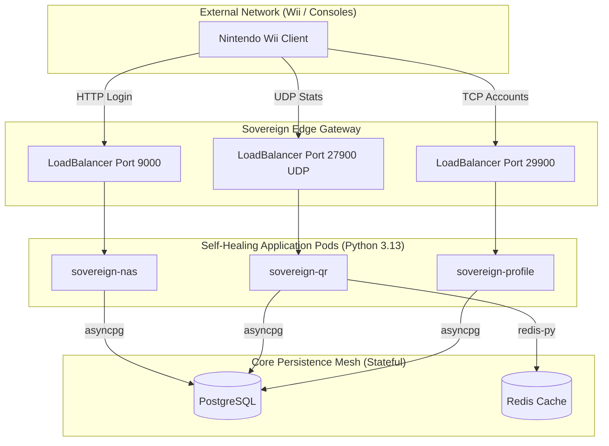

# 🏗️ Project Sovereign Cluster Architecture

This document visualizes and defines the high-availability, containerized microservice ecosystem deployed in **Phase 2** orchestrations.

## 🗺️ System Map

## 🧬 Core Principles

### 1. Immutable Containerization
All application code runs within an immutable Python 3.13 hardened base image (`Dockerfile`). Overriding `command` parameters in Docker Compose / K8s enables absolute image reuse across disparate daemon types, guaranteeing 100% execution environment parity.

### 2. The Self-Healing Paradigm
Unlike the legacy `master_server.py` monolith where a single python runtime crash would collapse all services, Project Sovereign treats each daemon as a managed resource. If `sovereign-qr` undergoes a fatal exception, the orchestration layer instantaneously resurrects the standalone container in milliseconds without disrupting existing HTTP login threads.

### 3. Zero-Touch Service Discovery
Services dynamically interrogate the ambient execution environment for `DATABASE_URL` and `REDIS_URL`. 
- **Docker Compose**: Discovers implicit bridge hostnames (`sovereign_db`)
- **Kubernetes**: Resolves internal namespace cluster DNS (`postgres.default.svc`)
- **Developer Machine**: Gracefully falls back to `localhost` dynamically.

---

## 🚦 Deployment Options

### A. Orchestrated Fleet (K3s/Kubernetes)
Standard high-availability delivery leverages standard manifests inside `/k8s/`. 
Command: `kubectl apply -f ./k8s/`

### B. Containerized Stack (Docker Compose)
Standard local development and evaluation setup.
Command: `docker compose up -d`
