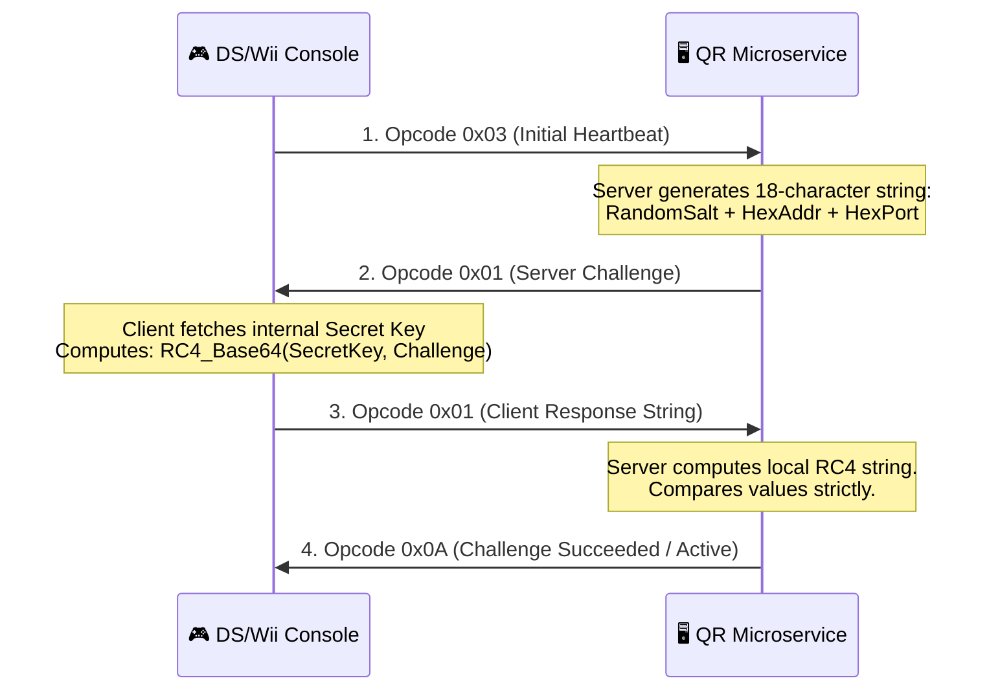

# 🧬 Project Sovereign Protocol Internals

This engineering document provides a technical breakdown of the custom networking protocols, cryptographic handshakes, and dynamic storage paradigms powering Nintendo DS and Wii network emulation.

---

## 🔐 Section 1: GameSpy Cryptographic Handshakes

The standard GameSpy core relies heavily on a custom implementation of **RC4 stream cipher** encryption combined with URL-safe **Base64 encoding** to secure client/server validations.

### 🤝 The Challenge/Response Vector
When a client triggers an availability handshake or account query, the transaction progresses through three discrete cycles:

### 📝 Key Implementation Vector
The core cipher relies on parsing `gslist.cfg` (centralized under `config/`). Internal code mapping inside [gs_utility.py](file:///Users/kalaimaranbalasothy/GitHub%20Projects/Project%20Sovereign/gamespy/gs_utility.py) intercepts and processes standard URL-safe variant transforms (swapping standard `+/` mapping with `-_` variants) to achieve byte-for-byte compatibility with original console expectations.

---

## 📦 Section 2: Sake Dynamic Persistence Stack

Sake provides games (most notably WarioWare DIY and Mario Kart Wii) with general-purpose, cloud-hosted relational database services via standard SOAP over HTTP payloads.

### 🧬 Dynamic Schema Generation
Unlike typical microservices with statically mapped tables, the Project Sovereign Storage Server supports **on-demand physical table creation**!

1. **Schema Introspection:** The service queries `information_schema.tables` to check if a game's requested bucket (e.g., `g2050_box`) exists.
2. **Automatic Expansion:** If absent, the storage engine issues an atomic DDL statement to create it natively in PostgreSQL. If a query requests an unmapped column, the server issues an `ALTER TABLE ADD COLUMN` natively to avoid manual intervention.
3. **SQL Generation Constraints:**
   - Translates legacy procedural trigger behaviors (updating modified timestamps) to standardized PostgreSQL `plpgsql` trigger procedures.
   - Replaces procedural row counters (`sqlite3_last_insert_rowid()`) with atomic Postgres `RETURNING recordid` identifiers to ensure safety during concurrent operations.

---

## 🤝 Section 3: NAT Negotiation (NatNeg) Engine

NAT Negotiation facilitates Peer-to-Peer (P2P) gaming lobbies between hardware consoles sitting behind separate residential NAT routers.

### 🛠️ The Core Opcode Handlers
All packets utilize a persistent **6-byte MAGIC prefix**: `[0xFD, 0xFC, 0x1E, 0x66, 0x6A, 0xB2]`.

| Opcode | Identifier | Engineering Function |
|--------|------------|----------------------|
| `0x00` | `INIT` | Primary registration. Sends client's internal private LAN address to server. |
| `0x0A` | `ADDR_CHECK` | **Reflection Engine:** Server examines client's incoming UDP frame source port/IP and reports it back (Opcode `0x0B`) so client learns its WAN/NAT boundary mappings. |
| `0x05` | `CONNECT` | Server constructs a cross-connected UDP payload mapping Console A's WAN endpoint to Console B, and vice versa, initializing hole-punch synchronization. |

Project Sovereign implements this utilizing Python 3.13 `asyncio.DatagramProtocol`, bypassing heavy Operating System threads to enable lightning-fast multiplexing of concurrent NatNeg attempts on UDP Port `27901`.
