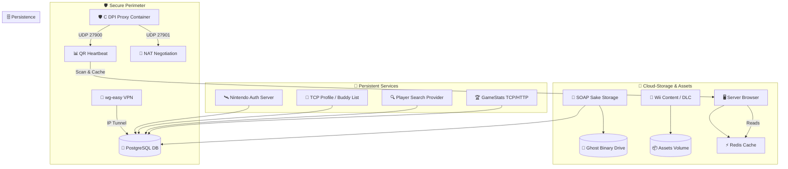

# 📚 Project Sovereign Technical Knowledge Base

Welcome to the core engineering repository for **Project Sovereign**. This catalog delivers complete technical specifications, packet blueprints, and database interface mappings for every protocol in our microservice arsenal.

---

## 🗺️ Master Architecture Map

Project Sovereign is engineered as a distributed service mesh. The diagram below maps the ingress boundaries, the secure DPI perimeter, and the backend storage connections shared by all components:

---

## 📑 Complete Server Deep-Dive Catalog

Explore the dedicated technical guides for every running component:

### 1. Ingress & Identity (The Base Layer)
*   **[🛰️ Nintendo Authentication (NAS)](file:///Users/kalaimaranbalasothy/GitHub%20Projects/Project%20Sovereign/docs/servers/nas_server.md):** HTTP Base tokens, RC4/MD5 hardware handshakes, and service discovery vectors.
*   **[👤 TCP Profile / Buddy Manager](file:///Users/kalaimaranbalasothy/GitHub%20Projects/Project%20Sovereign/docs/servers/gamespy_profile.md):** Persistent GPCM socket handling, friend request triggers, and online presence broadcasts.
*   **[🔍 Player Search Provider](file:///Users/kalaimaranbalasothy/GitHub%20Projects/Project%20Sovereign/docs/servers/gamespy_search.md):** Stateless GPSP TCP routines for verifying unique names and query constraints.

### 2. Matchmaking & Physics (The Gameplay Core)
*   **[📊 Query & Reporting Heartbeats](file:///Users/kalaimaranbalasothy/GitHub%20Projects/Project%20Sovereign/docs/servers/gamespy_qr.md):** UDP key-value broadcast standards, security boundary dropping, and real-time caching intervals.
*   **[🧬 NAT Negotiation (Hole-Punch)](file:///Users/kalaimaranbalasothy/GitHub%20Projects/Project%20Sovereign/docs/servers/gamespy_natneg.md):** Mathematical UDP mapping sequences used to construct low-latency direct P2P gameplay tunnels.
*   **[🖥️ Master Server Browser](file:///Users/kalaimaranbalasothy/GitHub%20Projects/Project%20Sovereign/docs/servers/gamespy_browser.md):** Multi-channel TCP lists returning optimized binary-packed IP matrices to lobbies.

### 3. Data Analytics & Warehousing (The Content Engines)
*   **[🏆 GameStats TCP & HTTP Surfaces](file:///Users/kalaimaranbalasothy/GitHub%20Projects/Project%20Sovereign/docs/servers/gamespy_gamestats.md):** Secure RC4 stat updates during match termination and RESTful leaderboard rendering.
*   **[📁 Cloud SOAP Sake Storage](file:///Users/kalaimaranbalasothy/GitHub%20Projects/Project%20Sovereign/docs/servers/gamespy_sake.md):** High-powered XML dynamic CRUD and file upload pipelines utilizing PostgreSQL JSONB.
*   **[💾 Wii Download Server (DLS1)](file:///Users/kalaimaranbalasothy/GitHub%20Projects/Project%20Sovereign/docs/servers/dls1_server.md):** Delivering DLC XML catalogues and static updates safely to custom Wii OS loaders.

### 4. Administration & Provisioning (User Boundaries)
*   **[🖥️ Operator Administration Dashboard](file:///Users/kalaimaranbalasothy/GitHub%20Projects/Project%20Sovereign/docs/servers/admin_portal.md):** Control plane for zero-trust MAC whitelists, active player tracking, and Prometheus SRE exporters.
*   **[🌐 Web User Registration Portal](file:///Users/kalaimaranbalasothy/GitHub%20Projects/Project%20Sovereign/docs/servers/user_registration.md):** Frontend bootstrap facilitating instant database account creation from standard web browsers.

---

## 📈 System-Wide References
*   **[Architecture Guide](file:///Users/kalaimaranbalasothy/GitHub%20Projects/Project%20Sovereign/docs/ARCHITECTURE.md):** Core principles, AsyncIO strategies, and layout anchoring configurations.
*   **[Database Schema Deep-Dive](file:///Users/kalaimaranbalasothy/GitHub%20Projects/Project%20Sovereign/docs/DATABASE_SCHEMA.md):** Table DDL summaries, indexes, and entity relation layouts.
*   **[Operations & Maintenance](file:///Users/kalaimaranbalasothy/GitHub%20Projects/Project%20Sovereign/docs/OPERATIONS.md):** Local dev setups, Docker reference logs, DNS redirects, and WireGuard setup instructions.
