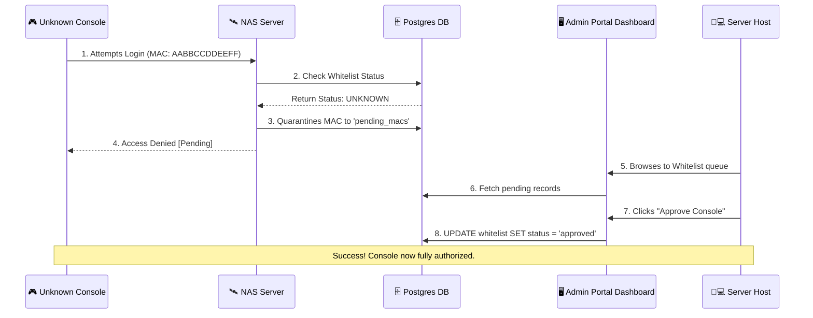

# 🖥️ Operator Administration Portal & Telemetry

The **Admin Portal** is the primary human interface for managing Project Sovereign. Designed for operators and server hosts, it delivers visual command controls over user governance (approving physical consoles, banning malicious IPs) alongside a dashboard monitoring backend microservice health.

---

## 📋 Service Blueprint
-   **Protocol:** RESTful HTTP
-   **Port Binding:** `9009`
-   **Architecture:** Lightweight Vanilla JS UI backed by a Python management daemon.
-   **Primary Users:** Server Hosts (Self-Hosters)

---

## 🧬 Core Administration Features

### 1. The MAC Hardware Whitelist System
To prevent unauthorized access to private servers, Project Sovereign includes an optional zero-trust whitelist:
*   **Status: Pending** -> When a new console connects, its hardware identifier is quarantined in the `pending_consoles` table.
*   **Status: Approved** -> The host logs into the UI, clicks **[Approve]**, and the console gains full access to matchmaking.

### 2. Real-Time User Bans
Operators can dynamically block abusive entities:
*   **Console Banning:** Blocks the unique Nintendo hardware ID permanently.
*   **IP Banning:** Instructs the firewall boundary to discard matching ingress traffic.

---

## 🔄 Governance Workflow Sequence

---

## 📊 SRE Observability Exporter (Prometheus)

In addition to administrative controls, the portal links with our telemetry engine (`prometheus_client`):
*   **Export Port:** `9102` (Scraped by Grafana)
*   **Core Telemetry Counters:**
    -   `sovereign_active_players`: Gauges concurrent GPCM TCP sessions.
    -   `sovereign_packets_total`: Tracks high-volume UDP throughput handled by the C WAF.
    -   `sovereign_queries_latency`: Tracks PostgreSQL response intervals.
