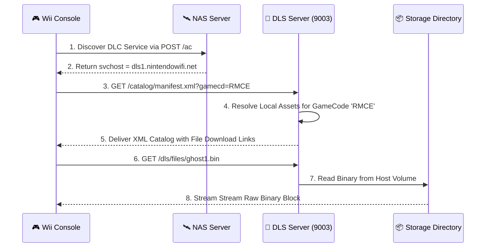

# 💾 Wii Download Server (DLS1) Protocol

The **Wii Download Server (DLS1)** handles downloadable content (DLC) delivery, in-game messaging catalogues, and game metadata propagation. It functions as a highly specialized static content delivery network, serving XML and binary catalogs formatted to satisfy rigid legacy Wii OS downloading engines.

---

## 📋 Service Blueprint
-   **Protocol:** HTTP (v1.1)
-   **Port Binding:** `9003`
-   **Content Exposed:** XML indexes, dynamic message lists, and raw update binaries.

---

## 🧬 Request Interception Standard

DLS1 requests are initiated by games like Animal Crossing, Mario Kart Wii, or Guitar Hero looking for server-side asset manifests.

### 1. Example Request Target Path
```http
GET /dls/v1/catalog/items.xml?gamecd=RMCE&region=E&lang=EN HTTP/1.1
Host: dls1.nintendowifi.net
```

### 2. Payload Template Sample
The server returns rigidly formatted XML headers describing dynamic content blocks:

```xml
<?xml version="1.0" encoding="UTF-8"?>
<dls>
  <catalog>
    <item id="1">
      <name>Ghost Data Update</name>
      <url>http://dls1.nintendowifi.net/dls/files/ghost1.bin</url>
      <size>12288</size>
    </item>
  </catalog>
</dls>
```

---

## 🔄 Delivery Workflow Matrix



---

## 📦 Directory & Mapping Schema

To host dynamic DLC, files are organized in a standard hierarchical structure within the DLS container context:

| Location Vector | Format | Role |
| :--- | :--- | :--- |
| `/app/assets/dls/[GAMECD]/manifest.xml` | Custom XML | The entry index that games read to see what exists. |
| `/app/assets/dls/[GAMECD]/*.bin` | Raw Data | The encrypted or packed game assets delivered. |

> [!NOTE]
> Many legacy games will crash if the HTTP `Content-Length` header is missing or doesn't match the physical file size perfectly. DLS1 includes automatic filesystem-stat header generation to guarantee zero-crash delivery.
