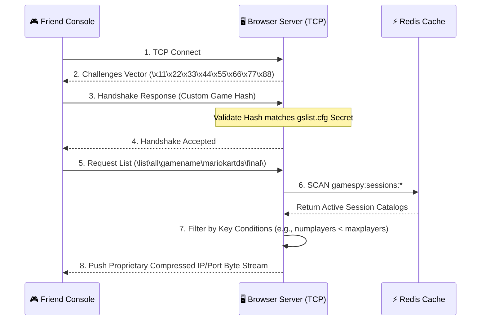

# 🖥️ GameSpy Master Server Browser Protocol

The **Master Server Browser** server is the central directory engine. When a console selects "Search for Games," it opens a TCP connection here to retrieve the live, filtered catalog of available matchmaking lobbies reported by **QR Servers**, allowing the player to pick a game and connect.

---

## 📋 Service Blueprint
-   **Protocol:** Stateful TCP
-   **Port Binding:** `28910`
-   **Format:** Hybrid ASCII query requesting a proprietary binary-compressed IP listing response.
-   **Performance:** High-speed delivery leveraging localized Redis caching!

---

## 🧬 Protocol Handshake & Cryptography

Because this exposes live IP catalogs, GameSpy implements a strict handshake to prevent automated web scrapers from harvesting server IPs:
1.  **Server Greeting:** The server sends an 8-byte ASCII challenge: `[8-char Random Salt]`.
2.  **Console Response:** The console combines the salt with the game's **Secret Key** (hardcoded in the `.nds` / `.wii` game binary) and returns an MD5 response vector.
3.  **Validation:** The server authenticates the response. If invalid, the socket is severed immediately.

---

## 🔄 Catalog Acquisition Flow



---

## 📊 Compressed Binary Response Layout

To minimize packet payloads on legacy 802.11b DS antennas, the server returns lobbies packed as static binary chunks instead of standard text:

```text
+--------------+----------------------+-------------------+-------------------------+
| Public IP    | Public Port          | Private IP        | Encoded Field Byte Map  |
| (4 Bytes)    | (2 Bytes, BigEndian) | (4 Bytes)         | (Variable)              |
+--------------+----------------------+-------------------+-------------------------+
```

### Field Packing Format
The field map references specific properties (like `hostname`, `numplayers`) mapped by index position rather than repetitive ASCII keys, slicing the payload size by roughly **75%**.

---

## ⚡ High-Performance Redis Integration

The server browser **never** performs blocking SQL lookups to service list requests. It scans our in-memory Redis cluster in constant time:

| Command Execute | Destination Key | Purpose |
| :--- | :--- | :--- |
| `SCAN` | `gamespy:sessions:[GAME]:*` | Retrieves all live lobbies within milliseconds. |
| `HGETALL` | `gamespy:session:[ID]` | Hydrates specific metadata payload for matching algorithms. |
