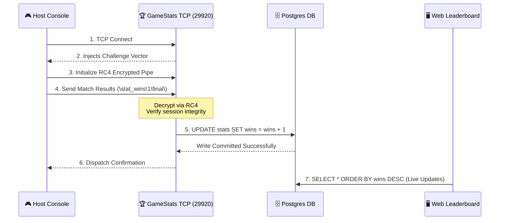

# 🏆 GameSpy GameStats Server Protocol (TCP & HTTP)

The **GameStats** subsystem is the historical archive of Project Sovereign. It records the mathematical artifacts of match terminations (race times, win/loss ratios, kill counts) and compiles them into global persistent leaderboards accessible via both encrypted TCP channels and standard HTTP APIs.

---

## 📋 Subsystem Architecture

GameStats is segregated into two distinct operational surfaces:

| Surface Engine | Protocol | Port | Primary Objective |
| :--- | :--- | :--- | :--- |
| **TCP Controller** | Stateful TCP | `29920` | Securely ingests match conclusion data using proprietary RC4 encryption. |
| **HTTP Engine** | RESTful HTTP | `9002` | Feeds leaderboard data to in-game browser menus. |

---

## 🧬 The Stateful TCP Protocol

When a game concludes, the host console opens a secure TCP channel to transmit the results.

### 1. Cryptographic Challenge Handshake
To prevent players from forging wins, GameStats uses a two-way RC4 cryptographic channel:
1.  The Server sends a dynamic binary challenge key.
2.  The Console initializes an RC4 stream cipher keyed with the Game Secret Key combined with the challenge.
3.  All subsequent binary snapshots are transmitted fully encrypted.

### 2. Result Parsing Flow (GameSpy Base64)
Stat values are compressed into standard GameSpy key-value streams, often encoded with a modified Base64 alphabet to preserve byte safety.

```text
\gameid\1234\profileid\5678\stat_wins\1\stat_races\12\final\
```

---

## 🔄 Statistics Reporting Matrix



---

## 🌐 The HTTP Leaderboard Surface (Port 9002)

Mainly utilized by Nintendo Wii games to display user stats on their main menus.

### Endpoint Catalog
-   `GET /gamestats/getstats.aspx` -> Returns current ranking and scores for a specific profile ID in XML or QS format.
-   `GET /gamestats/leaderboard.aspx` -> Returns sorted lists of the top players for a configured `gameid`.

---

## 🗄️ Database Persistence Design

| Table Name | Mutation Pattern | Data Lifecycle |
| :--- | :--- | :--- |
| `gamestats` | `INSERT` or `UPDATE` | Holds raw incremental integers and binary match history blobs. |
| `leaderboards` | Dynamic View | Computed aggregates ranking profiles by custom keys. |
