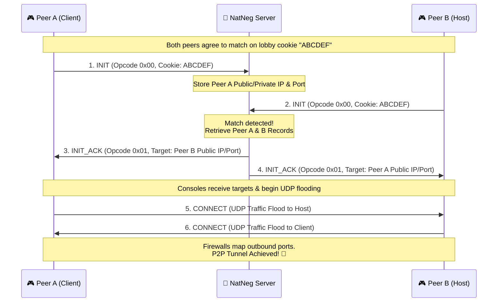

# 🧬 GameSpy NAT Negotiation (NatNeg) Protocol

The **NAT Negotiation (NatNeg)** protocol is the mathematical backbone of multiplayer connectivity. Retro consoles operate behind distinct consumer router configurations (NATs). NatNeg facilitates **UDP Hole Punching**, dynamically mapping internal and public IP/Port pairs, allowing two consoles to form a direct, low-latency Peer-to-Peer (P2P) gameplay tunnel.

---

## 📋 Service Blueprint
-   **Protocol:** Binary UDP
-   **Public Port Binding:** `27901` (via the High-Speed C DPI WAF Proxy)
-   **Backend Port:** `37901` (Internal container)
-   **Format:** Structured big-endian binary vectors

---

## 🛡️ Deep Packet Security Boundaries
The C-Proxy forces strict binary signature enforcement on Port 27901:
1.  **Strict Magic Check:** Every incoming packet *must* start with the static 6-byte GameSpy NatNeg magic sequence: `\xFD\xFC\x1E\x66\x6A\xB2`.
2.  **Length Threshold:** Drops any buffer smaller than 8 bytes immediately.
3.  **Opcode Constraint:** Restricts the 8th byte (opcode selector) to defined values between `0x00` and `0x10`, shielding our AsyncIO loops from scanner vectors.

---

## 📊 Binary Struct Anatomy

NatNeg uses fixed-offset binary layouts to maximize parsing speed:

```text
 0                   1                   2                   3
 0 1 2 3 4 5 6 7 8 9 0 1 2 3 4 5 6 7 8 9 0 1 2 3 4 5 6 7 8 9 0 1
+-+-+-+-+-+-+-+-+-+-+-+-+-+-+-+-+-+-+-+-+-+-+-+-+-+-+-+-+-+-+-+-+
|                      GameSpy Magic (6 Bytes)                  |
|               \xFD\xFC\x1E\x66\x6A\xB2                       |
+-+-+-+-+-+-+-+-+-+-+-+-+-+-+-+-+-+-+-+-+-+-+-+-+-+-+-+-+-+-+-+-+
|  Padding (1B) |  Opcode (1B)  |        Client Cookie          |
+-+-+-+-+-+-+-+-+-+-+-+-+-+-+-+-+                               +
|                          (4 Bytes)                            |
+-+-+-+-+-+-+-+-+-+-+-+-+-+-+-+-+-+-+-+-+-+-+-+-+-+-+-+-+-+-+-+-+
|                     Port Mapping Data / Extra...              |
+-+-+-+-+-+-+-+-+-+-+-+-+-+-+-+-+-+-+-+-+-+-+-+-+-+-+-+-+-+-+-+-+
```

---

## 🔄 The P2P Hole-Punching Matrix



---

## 🛠️ Essential Protocol Opcodes

| Hex | Symbol | Source | Purpose |
| :--- | :--- | :--- | :--- |
| `0x00` | `INIT` | Console | Tells the server "I am looking for a peer with this cookie." |
| `0x01` | `INIT_ACK` | Server | Broadcasts the companion peer's connection map back to both consoles. |
| `0x05` | `CONNECT` | Console | Injected to verify physical UDP reachability across firewalls. |

---

## 🗄️ Persistent Memory States

NatNeg is **stateless** on disk but highly **stateful in server RAM**. The server runs an in-memory dynamic pairing catalog using the 4-byte `Cookie` as the lookup key.
-   **Entry TTL:** Matches expire from RAM if a companion peer does not connect within **30 seconds**, preventing memory leak accumulation from orphaned requests.
