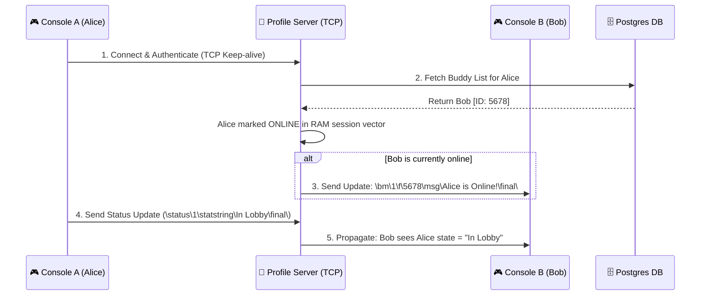

# 👤 GameSpy Profile Server (GP Accounts & Presence)

The **GameSpy Profile (GP)** server is the persistent heartbeat of user identity. Combining **GPCM** (Client Manager) and **GPSP** (Search Provider), it handles persistent TCP connections for friend lists, online status broadcasting (Presence), account authentication, and buddy request propagation.

---

## 📋 Service Blueprint
-   **Protocol:** Persistent TCP
-   **Port Binding:** `29900`
-   **Subsystem Responsibilities:**
    -   `GPCM` -> Stateful buddy list sync and online presence tracking.
    -   `GPSP` -> Profile bootstrapping, unique nick validation, and searching.
-   **Format:** Backslash-delimited ASCII commands (`\key\value\`)

---

## 🧬 Message Formatting Standards

Communication uses standard GameSpy key-value commands. Command tags are prefixed by double backslashes and terminated with a `\final\` tag:

### 1. Sample Command Stream
```text
\login\1\user\dwc_racer\challenge\abcdefgh12345678\response\a3e2f8b1...\final\
```

### 2. Cryptographic Handshake (`\login\`)
To secure credentials, GameSpy implements a custom dual-salt hashing handshake:
1.  The Console sends a `\login\`.
2.  The Server computes a dynamic challenge and issues a salt.
3.  The Console creates an **MD5 hash** combined from the password hash, static game product keys, and dynamic session salts.
4.  Server reproduces the hash locally from PostgreSQL and grants access.

---

## 🔄 Presence & Buddy Sequence



---

## 🗄️ Core Database Tables Mutated

| PostgreSQL Table | Mutation Vectors | Role |
| :--- | :--- | :--- |
| `profiles` | `INSERT` / `UPDATE` | Stores hashed passwords, custom nicknames, last login timestamps. |
| `buddies` | `INSERT` / `DELETE` | Stores bidirectional tracking mappings between profile IDs. |
| `blocks` | `INSERT` | Holds explicit ignore/blacklist relationships between peers. |

---

## 🔑 Key Command Reference

| Command Tag | Direction | Purpose |
| :--- | :--- | :--- |
| `\login\` | C -> S | Authenticates the user profile using custom MD5 response. |
| `\status\` | C -> S | Updates the console's active status (Offline, Online, In-Lobby). |
| `\bm\` | S -> C | Buddy Message. Transmits presence changes and text messages. |
| `\addbuddy\` | C -> S | Initiates a bidirectional friend request vector. |
