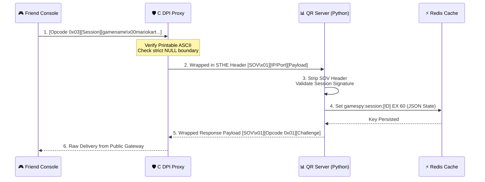

# 📊 GameSpy Query & Reporting (QR) Protocol

The **Query & Reporting (QR)** protocol is a high-volume UDP state conduit. Physical consoles run local game sessions and broadcast real-time metadata (player count, current map, game speed) back to the QR server, allowing our backend to populate the global master matchmaking browser.

---

## 📋 Service Blueprint
-   **Protocol:** UDP
-   **Public Port Binding:** `27900` (via the High-Speed C DPI WAF Proxy)
-   **Backend Port:** `37900` (Internal container)
-   **Format:** Custom binary-prefixed null-delimited strings (`\x00`)

---

## 🛡️ The Security Boundary (DPI Filtering)
Because QR accepts raw key-value streams, we run it through our **C WAF Filter Interface** to drop attacks instantly:
1.  **Printable ASCII:** Ensures payload contains only standard text and null characters.
2.  **Termination Check:** Guarantees the string array strictly ends with double null bytes (`\x00\x00`), instantly dropping scanner probes or binary injection buffer overflows!

---

## 🧬 Packet Struct & Handshake Sequence

### 1. Protocol Anatomy Diagram
QR packets use single-byte OPCODES followed by the 4-byte Instance/Session ID:

```text
+--------------+----------------------+-----------------------------------------+
| Opcode (1B)  | Session ID (4B, LE) | Payload (Variable, Null-terminated)     |
+--------------+----------------------+-----------------------------------------+
```

### 2. Essential Opcodes

| Hex Opcode | Purpose | Description |
| :--- | :--- | :--- |
| `\x03` | **Heartbeat** | Sent periodically by console to update lobby values. |
| `\x09` | **Availability** | Console pings to confirm server online states. |
| `\x01` | **Challenge** | Transmitted by server to verify console responsiveness. |

---

## 🔄 Transaction Sequence Matrix



---

## 🗄️ Database & Cache Mutators

| Component | Mutation Target | Lifecycle |
| :--- | :--- | :--- |
| **Redis** | `gamespy:sessions:[session_id]` | Set to expire within **60 seconds**. Keeps the browser pool 100% real-time. |
| **Postgres** | `profiles` | Reads owner profile validation details upon start. |

---

## 📝 Sample Payload Parsing Trace

When Mario Kart DS reports a lobby, the inbound payload looks like this in hexadecimal inspection:

```text
03 12 34 56 78 67 61 6d 65 6e 61 6d 65 00 6d 61 72 69 6f 6b 61 72 74 64 73 00 ...
```

**Translated Anatomy:**
- `03` -> Heartbeat opcode
- `12 34 56 78` -> Little-endian Session ID
- `67 61 ... 65` -> Key: `"gamename"`
- `00` -> Null Delimiter
- `6d 61 ... 73` -> Value: `"mariokartds"`
- `00` -> End key-value node
