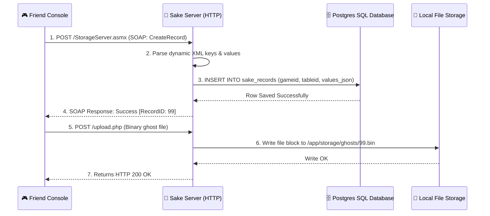

# 📁 GameSpy Sake Data & File Storage Protocol

The **GameSpy Sake** protocol is a powerful Cloud-Storage middleware. It provides an abstracted remote database API, allowing consoles to dynamically store, query, and share binary blobs (like custom Mario Kart decals, Smash Bros stages, or ghost racing files) using structured XML RPC.

---

## 📋 Service Blueprint
-   **Protocol:** HTTP-based SOAP XML RPC
-   **Port Binding:** `8000`
-   **Format:** W3C Standard SOAP Envelopes (`text/xml`)
-   **Database Vector:** Complex dynamic field hydration inside PostgreSQL!

---

## 🧬 SOAP Request / Response Standard

Communication uses structured HTTP `POST` targets pointing to Sake SOAP action endpoints. 

### 1. Typical Request Header Target
```http
POST /SakeStorageServer/StorageServer.asmx HTTP/1.1
SOAPAction: "http://gamespy.net/sake/SearchForRecords"
```

### 2. Dynamic XML Payload Sample (Querying Leaderboard Maps)
```xml
<soap:Envelope xmlns:soap="http://schemas.xmlsoap.org/soap/envelope/">
  <soap:Body>
    <SearchForRecordsRequest xmlns="http://gamespy.net/sake">
      <gameid>1234</gameid>
      <tableid>my_ghost_data</tableid>
      <filter>track_id = 7 AND time &lt; 60000</filter>
      <sort>time ASC</sort>
    </SearchForRecordsRequest>
  </soap:Body>
</soap:Envelope>
```

---

## 🔄 Transaction Sequence Matrix



---

## 🛠️ Essential SOAP Methods Handled

| SOAP Method Action | Mode | Purpose |
| :--- | :--- | :--- |
| `GetMyRecords` | Read | Fetches cloud-saved variables owned exclusively by the connecting profile ID. |
| `SearchForRecords` | Query | Executes dynamic SQL-safe conditional lookups (e.g., sorting high scores). |
| `CreateRecord` | Write | Allocates a new key-value record for the active game profile. |
| `UpdateRecord` | Write | Modifies properties in existing JSON record nodes. |
| `UploadFile` | Binary | Generates unique file handles used to route binary uploads. |

---

## 🗄️ Database Engineering Design

Sake is highly dynamic; it must store properties it has never seen before without altering static SQL columns. Project Sovereign solves this via a highly engineered schema:

-   **`sake_tables`:** Maps physical game identifiers to table-like metadata abstractions.
-   **`sake_records`:** Contains a `values` JSONB column. This allows dynamic JSON queries inside PostgreSQL, enabling blistering-fast indexing without rigid relational overhead.
