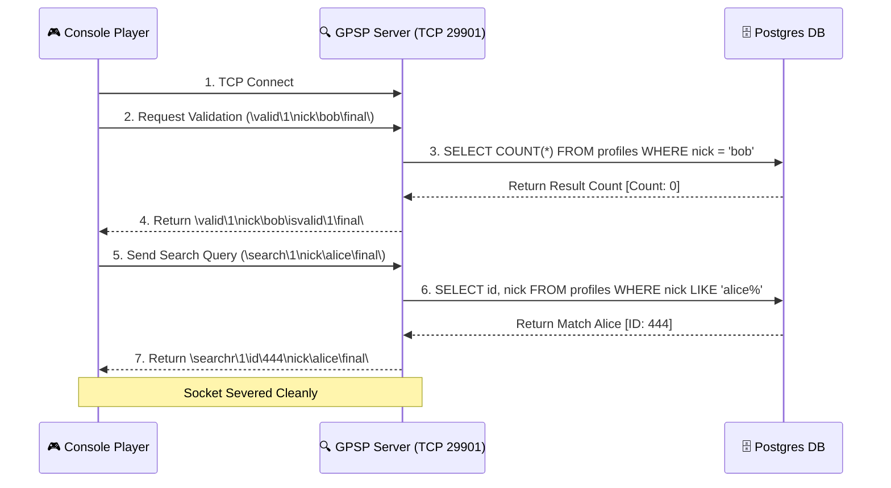

# 🔍 GameSpy Player Search Server (GPSP) Protocol

The **GameSpy Player Search (GPSP)** server is a supporting partner to the profile subsystem. It manages short-lived, stateless TCP transactions focused entirely on searching for player profiles, validating unique nicknames during account creation, and querying public buddy data.

---

## 📋 Service Blueprint
-   **Protocol:** Stateless TCP (Connect -> Query -> Response -> Close)
-   **Port Binding:** `29901`
-   **Format:** Backslash-delimited ASCII commands (`\key\value\`)

---

## 🧬 Key Queries & Workflows

GPSP evaluates commands to find profiles by unique tags, email, or console profile ID.

### 1. Nickname Validation (`\valid\`)
When a user types a new player name, the console sends this query to ensure no duplicates exist.
```text
\valid\1\email\dwc_runner@nintendo.com\nick\dwc_runner\final\
```

### 2. User Searching (`\search\`)
Used to find friends by typing their display name.
```text
\search\1\sesskey\987654321\nick\alice\final\
```

---

## 🔄 Workflow Discovery Sequence



---

## 🗄️ Database Queries Handled

Because searching parses human input, GPSP is optimized to prevent SQL query bottlenecks:

| Objective | Query Vector | DB Security |
| :--- | :--- | :--- |
| **Duplicate Nick Check** | Indexed `EXISTS` check. | Prevents race conditions during multi-thread account creation. |
| **Player Searching** | Bounds-limited SQL `LIKE` clause. | Strict 50-result limits to prevent database thread starvation. |
