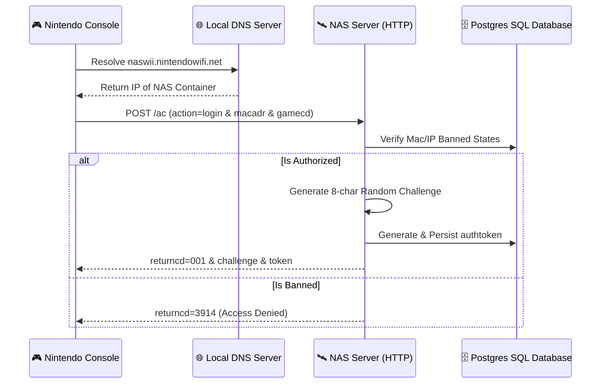

# 🛰️ Nintendo Authentication Server (NAS) Protocol

The **Nintendo Authentication Server (NAS)** is the absolute gateway for any physical console joining the network. It acts as the root identity provider, validating the console hardware IDs (MAC, serials) and issuing standard cryptographic tokens used for all subsequent GameSpy sessions.

---

## 📋 Service Blueprint
-   **Protocol:** HTTP (v1.0/v1.1)
-   **Port Binding:** TCP `9000`
-   **Server Path Targets:**
    -   `GET /` -> Conntest (Nintendo "internet alive" heartbeat)
    -   `POST /ac` -> Core account and session management
    -   `POST /pr` -> Dynamic word/dictionary validation

---

## 🧬 Protocol Signature & Formatting

Communication operates over standard HTTP `POST` vectors using URL-encoded query string parameters in both directions.

### 1. Inbound Request Body Structure
Every console payload includes hardware metadata parameters:
```text
action=login&userid=123456&macadr=001122334455&gamecd=MARIOKARTDS&passwd=...
```

### 2. Outbound Response Format
The server returns key-value pairs separated by ampersands:
```text
retry=0&returncd=001&challenge=ABCDEFGH&token=NDS_GS_TOKEN_XYZ&datetime=20260512143000
```
> [!NOTE]
> NAS responds with HTTP `200 OK` and custom headers `NODE: wifiappe1` and `Server: Nintendo Wii (http)` to satisfy rigid legacy client parsers.

---

## 🔄 Authentication Flow Matrix



---

## 🛠️ Core Action Dispatcher

### 1. `acctcreate` (Account Bootstrap)
Triggered when a game card connects for the first time.
*   **Returns:** `userid` (auto-incremented from `gamespy.profiles` base sequence).
*   **Effect:** Seeds new client record waiting for GameSpy registration.

### 2. `login` (Session Start)
Initiates connection sequences. Generates:
*   **`challenge`:** 8-byte random salt utilized in legacy RC4 handshake.
*   **`token`:** An alphanumeric state tracker identifying the current active profile context.

### 3. `svcloc` (Service Discovery)
Returns target addresses for other content delivery engines.
*   Used to fetch hostnames for **DLS1** content servers based on incoming `svc` codes.

---

## 🗄️ Database Integrations

NAS mutates and reads core user-governance tables:

| Database Domain | Mutated Column/Table | Role |
| :--- | :--- | :--- |
| **Bans** | `db.is_banned()` -> Reads IP/Console blacklist | Instantly drops traffic before allocating tokens. |
| **Profiles** | `db.get_next_available_userid()` | Reserves global Unique Integer IDs. |
| **Tokens** | `db.generate_authtoken()` | Stores dynamic session vectors in memory/cache. |
