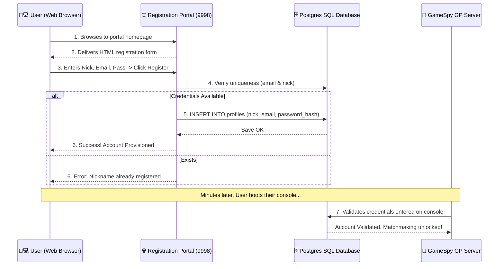

# 🌐 User Registration Portal Protocol (Optional)

The **Registration Portal** is an optional user-facing gateway of Project Sovereign. 

> [!TIP]
> Project Sovereign automatically seeds player profiles via **Silent Auto-Registration** when physical consoles connect for the first time. This web portal is purely complementary, serving players who want to reserve a custom display nickname or users on emulators that lack direct Nintendo hardware signatures.

---

## 📋 Service Blueprint
-   **Protocol:** HTTP (v1.1)
-   **Port Binding:** `9998`
-   **Access Target:** `http://[host_ip]:9998/`
-   **Target Audience:** End-Users (Players)

---

## 🧬 Web Interface Operations

The microservice serves a clean HTML5/CSS registration grid.

### Required Input Vector Fields:
1.  **`Nickname`:** The display name seen by friends in the lobby.
2.  **`Email`:** Used as the primary account lookup key.
3.  **`Password`:** Stored in PostgreSQL using strict hashing formats compatible with GameSpy's login handshake.
4.  **`Console ID`:** (Optional) Links the profile to a specific physical hardware signature.

---

## 🔄 Registration Provisioning Workflow

---

## 🗄️ Database Seeding Impact

The Registration Portal initializes the core identity rows that all other services rely upon:

| Table Target | Values Injected | Purpose |
| :--- | :--- | :--- |
| `profiles` | `nick`, `email`, `password` | Establishes physical authentication footprint. |
| `accounts` | `owner_id`, `creation_date` | Tracks global ownership structures. |
